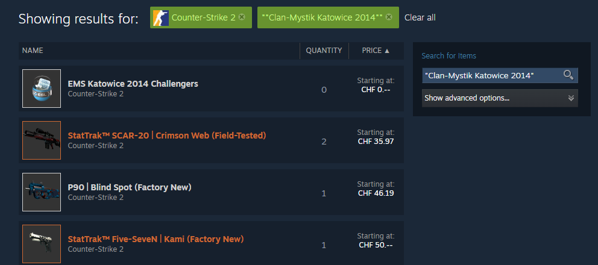
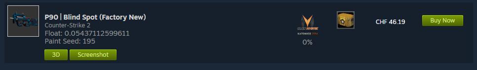
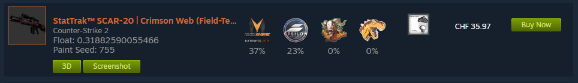

# Counter-Strike-2-Katowice-2014-Sticker-Search
A simple java project to search for items with specifiic CS 2 stickers on the Steam Community Market.

This program creates urls which list all skins with a specific sticker placed on it. The Steam Community Market usually doesn't let you search for skins like that so this simple program might come in handy if you're looking for a skin with a sticker. It currently only works with **Katowice 2014 paper** stickers. More stickers might be added in the future. You can find all stickers and their names which you can pass as arguments to the program in the **stickers** folder.

The created URLs will look something like [this](https://steamcommunity.com/market/search?q=%22Clan-Mystik%20Katowice%202014%22&descriptions=1&category_730_ItemSet%5B%5D=any&category_730_Weapon%5B%5D=any&category_730_Quality%5B%5D=#p1_price_asc). If you paste the created URLs oin your browser the result should look something like this:

Every listed skin will have **at least** one of the stickers you've searched for applied like in this example below: 

When searching for skins with stickers make sure to check whether a sticker is **scratched** or not! I'd recommend using an extension like the [floatdb extension](https://github.com/csfloat/extension) to avoid buying skins with scratched stickers. If the percentage next to a sticker is higher than 0% it means that the sticker has been scratched at least one time decreasing its value. 

### To do
- add some sort of gui to select what sticker someone is looking for.
- add the functionality of searching for katowice 2014 **holo** stickers.